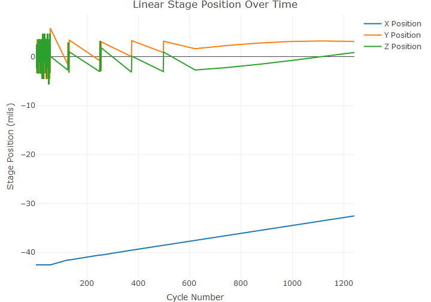

```
## [1] "Max Force: 9.8673702 on cycle 869 at Y-position 2.7519685 and Z-position -1.59448819" 
## [2] "Max Force: 9.8673702 on cycle 993 at Y-position 3.07086614 and Z-position -0.82677165"
## [3] "Max Force: 9.8673702 on cycle 1117 at Y-position 3.18110236 and Z-position 0.00787402"
## [4] "Max Force: 9.8673702 on cycle 1241 at Y-position 3.07480315 and Z-position 0.82677165"
```

```
## [1] "Min Force: 2.198776 on cycle 49 at Y-position -4.55511811 and Z-position -3.3976378"
```





