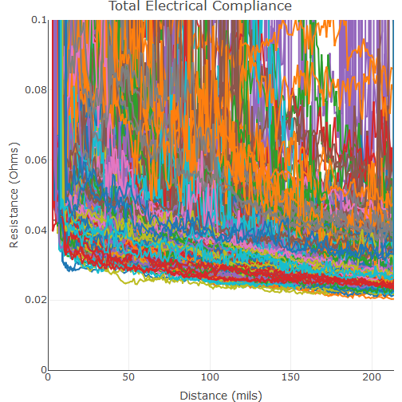
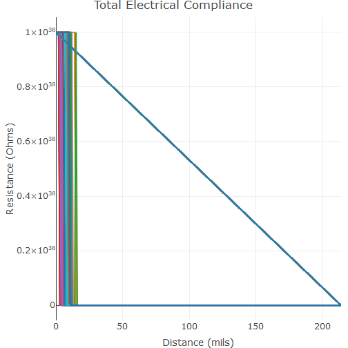

```r
# Load in the data
d <- read.delim(pth, header = TRUE, sep = "\t", dec = ".", comment.char = "!", fill = TRUE)
```

```
## Error in file(file, "rt"): invalid 'description' argument
```

```r
# Get the columns 
first_resistance_column <- which(names(d) == "Date") + 1 # used to indicate which column is the first one that contains resistacne data
last_resistance_coluimn <- which(names(d) == "FBSteps") - 1 # specifies the last column that contains resistance data

# Create the plot
plt <- plot_ly(data = d, type = "scatter", mode = "lines")
for(i in first_resistance_column:last_resistance_coluimn){
  plt <- plt %>% add_trace(x = ~External.Z.Delayed, y = d[,i], name = names(d)[i])
}

# Add labels and set range limit
plt_title <- c("Total Electrical Compliance")
plt <- plt %>% layout(xaxis = list(title = "Distance (mils)"), 
                      yaxis = list(range = c(0,max_resistance), 
                                   title = c("Resistance (Ohms)")),
                      title = plt_title, 
                      showlegend = FALSE)
plt
```




```r
# This produces the exact same plot as the above code, but does not limit the range of the y-axis so that opens can be seen


# Load in the data
d <- read.delim(pth, header = TRUE, sep = "\t", dec = ".", comment.char = "!", fill = TRUE)
```

```
## Error in file(file, "rt"): invalid 'description' argument
```

```r
# Get the columns 
first_resistance_column <- which(names(d) == "Date") + 1 # used to indicate which column is the first one that contains resistacne data
last_resistance_coluimn <- which(names(d) == "FBSteps") - 1 # specifies the last column that contains resistance data

# Create the plot
plt <- plot_ly(data = d, type = "scatter", mode = "lines")
for(i in first_resistance_column:last_resistance_coluimn){
  plt <- plt %>% add_trace(x = ~External.Z.Delayed, y = d[,i], name = names(d)[i])
}

# Add labels and set range limit
plt_title <- c("Total Electrical Compliance")
plt <- plt %>% layout(xaxis = list(title = "Distance (mils)"), 
                      yaxis = list(title = "Resistance (Ohms)"), 
                      title = plt_title, 
                      showlegend = FALSE)
plt
```


```


